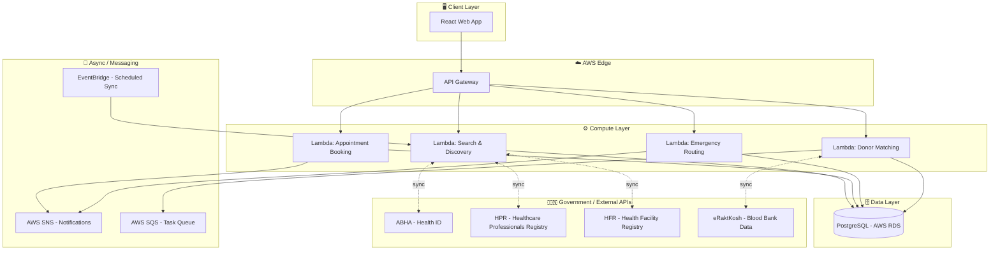
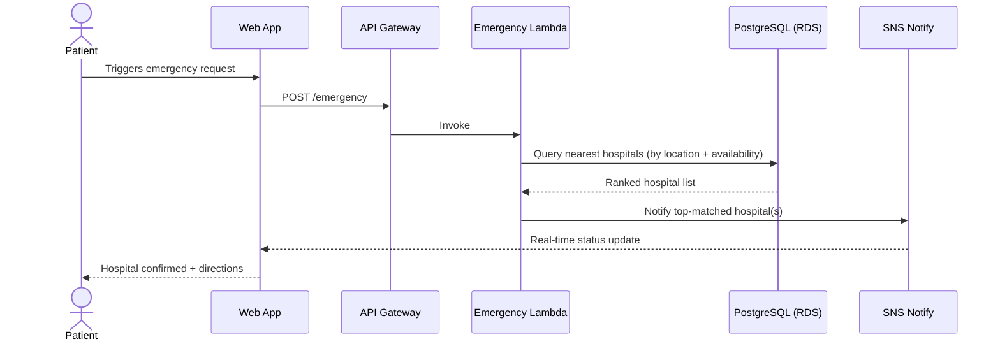
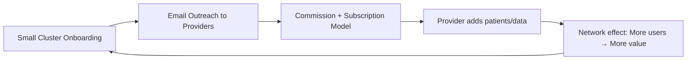

<div align="center">

# 🩸 Sanjeevani Setu

### One platform. Every healthcare body. Zero wasted minutes.

<!-- 🖼️ PLACEHOLDER: Add your "Akinator-style" hero image here -->
<!-- Suggested: a thinking figure with a chat bubble asking "Which healthcare service do I need?"
     surrounded by fragmented, chaotic app icons — conveying the chaos this project solves. -->


*Built for **Smart India Hackathon 2026** (Internal Round, SGSITS Indore)*

[Problem](#-the-problem) •
[Solution](#-our-solution) •
[Architecture](#-system-architecture) •
[Tech Stack](#-tech-stack) •
[Roadmap](#-implementation-roadmap) •
[Feasibility](#-feasibility--cost) •
[Risks](#-risks--mitigations) •
[Impact](#-impact)

</div>

---

## 📌 What We're Building

A **web app that acts as a single communication bridge** between the fragmented players in India's healthcare system:

| Connects | To |
|---|---|
| 🩸 Blood Donors | → Blood Banks |
| 🏦 Blood Banks | → Hospitals & Patients |
| 🧑‍⚕️ Patients | → Local Doctors (online consultations) |
| 🚑 Emergency Patients | → Nearest Available Hospitals |

> In short: **discovery + booking + emergency routing**, unified — instead of scattered across 100s of disconnected listings, apps, and phone calls.

---

## ❗ The Problem

1. India has **hundreds of healthcare bodies** — hospitals, blood banks, diagnostic centers, individual doctors — each operating in its own silo.
2. In an emergency, **every second spent searching for the right facility is a second not spent treating the patient.**
3. There is currently **no single platform** where a patient can discover, verify, and act on all of this at once.

<!-- 🖼️ PLACEHOLDER: Add your "idea" screenshot / sketch here -->


---

## 💡 Our Solution

We are **not rebuilding healthcare infrastructure** — we are **unifying access to infrastructure that already exists**, most of it built and maintained by the Government of India.

- ✅ Aggregates hospitals, doctors, blood banks, and patients on **one platform**
- ✅ Pulls **verified, real-time data** from government registries instead of manual listings
- ✅ Prioritizes the **emergency path** — routing a patient to the nearest available hospital in seconds, not searches

### What makes this different?

| Existing platforms | Sanjeevani Setu |
|---|---|
| 1000s of separate apps for booking, listing, donating | One unified access layer |
| Manually entered, often outdated data | Sourced live from government APIs (ABHA, HPR, HFR, eRaktKosh) |
| No emergency-first design | Emergency routing is a core module, not an afterthought |
| Building new infra from scratch | Orchestrating infra that already exists and is trusted |

---

## 🏗️ System Architecture

<!-- 🖼️ PLACEHOLDER: You can drop in your actual system design screenshot instead of/alongside this diagram -->


### High-Level Architecture (Mermaid)



### Emergency Flow (the critical path)



---

## 🧰 Tech Stack

| Layer | Technology |
|---|---|
| **Frontend** | HTML, CSS, JavaScript, React |
| **Backend** | Node.js |
| **Database** | PostgreSQL (AWS RDS) |
| **Cloud / Infra** | AWS API Gateway, AWS Lambda, AWS EC2, AWS SNS, AWS SQS, EventBridge |
| **Government APIs** | ABHA (Ayushman Bharat Health Account), HPR (Healthcare Professionals Registry), HFR (Health Facility Registry), eRaktKosh |

> 💡 We deliberately chose a **serverless-first** architecture (Lambda + API Gateway) to keep idle costs near-zero — important for a pre-revenue prototype.

<!-- 🖼️ PLACEHOLDER: Add your working prototype screenshot(s) here -->
## 📸 Prototype


---

## 🚀 Implementation Roadmap

### Process
1. **Start small** — onboard a small cluster of hospitals/doctors/blood banks first, not a national rollout.
2. **Email marketing outreach** — invite healthcare providers to join, pitching increased reach with less manual effort.
3. **Monetization from day one** — commission-based + subscription model, kept simple initially.

### Methodology
A lightweight web app that:
1. Fetches hospital, doctor, patient, and blood bank data via **government APIs**.
2. Displays it to end users (patients) in a clean, unified interface.
3. Acts purely as a **bridge/orchestration layer** — not a data owner.



---

## 💰 Feasibility & Cost

- **Highly cost-effective** — built on infrastructure already run by the Government of India (no need to build health registries ourselves).
- **Estimated cloud cost:** ~₹300–₹500 per 100,000 operations.
- **Fast to build** — primarily an integration & orchestration effort, not ground-up infrastructure.
- **AWS Activate credits ($1,200)** cover initial infra costs until the platform becomes self-sustaining.

---

## ⚠️ Risks & Mitigations

| # | Risk | Mitigation |
|---|---|---|
| 1 | Lack of in-house skill to make this production-ready | Collaborate with experienced developers; seek investor funding; onboard paying beta customers pre-launch at discounted subscription rates |
| 2 | Government API access takes time to approve | Use demo/sandbox data and publicly available government datasets for the prototype phase |
| 3 | Undiscovered/hidden costs | Invest in an efficient, well-modeled system design upfront to minimize surprises |
| 4 | Low public awareness of the service | Onboard hospitals & doctors first — they bring their own patients onto the platform, driving organic growth with less marketing spend |

---

## 🌍 Impact

- **Lakhs of people** stand to benefit directly, every single day.
- Saves the **critical first hours** in an emergency — time currently lost searching for the right hospital, blood bank, or doctor.
- Makes healthcare access **simpler, faster, and more transparent** for patients, while giving providers a low-effort way to reach more people.

---

## 📂 Repository Structure

```
.
├── docs/
│   └── assets/              # Screenshots & diagrams referenced in this README
├── client/                  # React frontend
├── server/                  # Node.js backend / Lambda functions
├── infra/                   # AWS infra (IaC / config)
└── README.md
```

---

<div align="center">

**Team Sanjeevani Setu** · Smart India Hackathon 2026 · SGSITS, Indore

</div>
